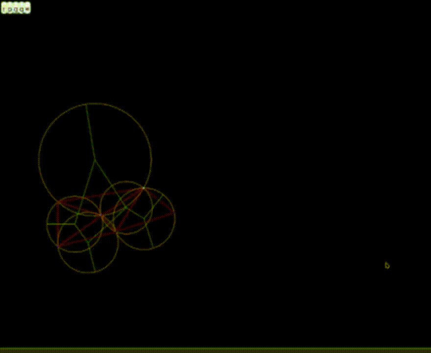

#+author: Emiliano Galeana Araujo

* Proyecto de Tesis

** Instrucciones

+ Para correr el programa:

  #+BEGIN_SRC bash
    make run R=True FILE=example.tes
  #+END_SRC

  Donde =example.tes= es el archivo que  se va a leer que contiene los
  puntos (y se encuentra en la  carpEta =Examples=), Y =True= nos dice
  si se va a mover un punto (para mover todos es con =False=).

  Debe verse así:

  

+ Si se quiere limpiar el directorio de los binarios:

  #+BEGIN_SRC bash
    make clean
  #+END_SRC

+ Finalmente, si se quieren correr las pruebas unitarias:

  #+BEGIN_SRC bash
    make test
  #+END_SRC

** Biblioteca

Se usa [[https://processing.org/][processing]] para dibujar  los objetos geométricos, la biblioteca
está incluida en el directorio  ~lib/~. Tal vez sea necesario realizar
el siguiente comando.
